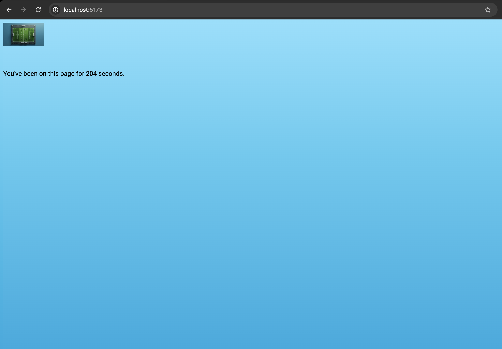
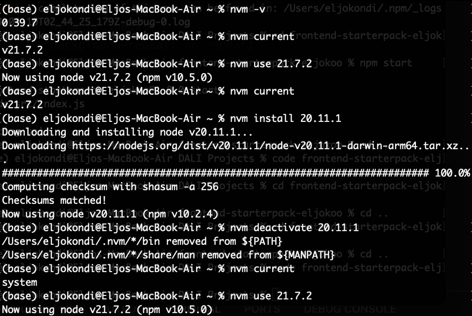

# Frontend Starterpack with Vite

First Frontend Starterpack with Vite, linting, sass - to be used in future projects

[deployed url](https://frontend-starterpack-eljokoo.onrender.com)

## What Worked Well

Generally felt comfortable with npm and vite.

## What Didn't

Tried the extra credit which was including some vite plugins but struggled to set them up correctly.

## Extra Credit

- Got nvm to work and used in terminal

## Screenshots

